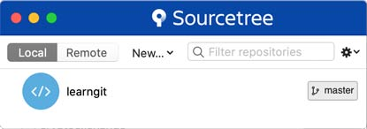
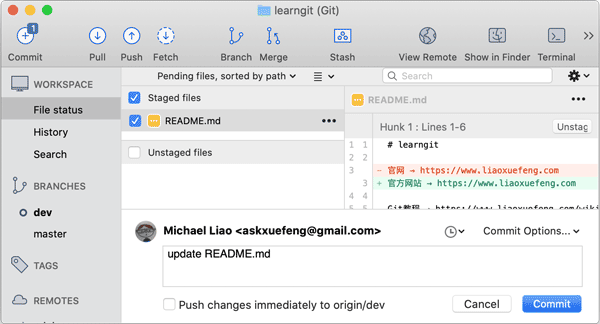

# GUI 工具

当我们对 Git 的提交、分支已经非常熟悉，可以熟练使用命令操作 Git 后，再使用 GUI 工具，就可以更高效。

Git 有很多图形界面工具，这里我们推荐 [Source Tree](https://www.sourcetreeapp.com)，它是由 [Atlassian](https://www.atlassian.com) 开发的免费 Git 图形界面工具，可以操作任何 Git 库。

首先从下载 Source Tree 并安装，然后直接运行。

第一次运行时，Source Tree 并不知道我们的 Git 库在哪。如果本地已经有了 Git 仓库，直接从资源管理器把文件夹拖拽到 Source Tree 上，就添加了一个本地 Git 库：

也可以选择【New】→【Clone from URL】直接从远程克隆到本地。

## 提交

我们双击 learngit 这个本地库，Source Tree 会打开另一个窗口，展示这个 Git 库的当前所有分支以及文件状态。选择左侧面板的【RORKSPACE】→【File status】，右侧会列出当前已修改的文件（Unstaged files）：

选中某个文件，该文件就自动添加到【Staged files】，实际上是执行了 `git add README.md` 命令：

然后，我们在下方输入 Commit 描述，点击【Commit】，就完成了一个本地提交：

实际上是执行了 `git commit -m "update README.md"` 命令。

使用 Source Tree 进行提交就是这么简单，它的优势在于可以可视化地观察文件的修改，并以红色和绿色高亮显示。

## 分支

在左侧面板的【BRANCHES】下，列出了当前本地库的所有分支。当前分支会加粗并用 `o` 标记。要切换分支，我们只需要选择该分支，例如 master，然后点击右键，在弹出菜单中选择【Checkout master】，实际上是执行命令 `git checkout master`：

要合并分支，同样选择待合并分支，例如 dev，然后点击右键，在弹出菜单中选择【Merge dev into master】，实际上是执行命令 `git merge dev`：

## 推送

在 Source Tree 的工具栏上，分别有【Pull】和【Push】，分别对应命令 `git pull` 和 `git push`，只需注意本地和远程分支的名称要对应起来，使用时十分简单。

注意到使用 Source Tree 时，我们只是省下了敲命令的麻烦，Source Tree 本身还是通过 Git 命令来执行任何操作。如果操作失败，Source Tree 会自动显示执行的 Git 命令以及错误信息，我们可以通过 Git 返回的错误信息知道出错的原因：

:::warning 小结
使用 Source Tree 可以以图形界面操作 Git，省去了敲命令的过程，对于常用的提交、分支、推送等操作来说非常方便。

Source Tree 使用 Git 命令执行操作，出错时，仍然需要阅读 Git 命令返回的错误信息。
:::

