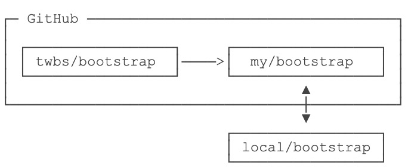

# 参与开源项目

我们一直使用 GitHub 作为免费的远程仓库，如果是个人的开源项目，放到 GitHub 上是完全没有问题的。其实 GitHub 还是一个开源协作社区，通过 GitHub，既可以让被人参与你的开源项目，也可以参与别人的开源项目。

在 GitHub 出现以前，开源项目开源容易，但让广大人民群众参与进来比较困难，因为要参与，就要提交代码，而给每个想提交代码的群众都开一个账号那是不现实的，因此，群众也仅限于报个 bug，即使能改掉 bug，也只能把 diff 文件用邮件发过去，很不方便。

但是在 GitHub 上，利用 Git 极其强大的克隆和分支功能，广大人民群众真正可以自由参与各种开源项目了。

如何参与一个开源项目呢？比如人气极高的 bootstrap 项目，这是一个非常强大的 CSS 框架，你可以访问它的项目主页 <https://github.com/twbs/bootstrap>，点【Fork】就在自己的账号下克隆了一个 bootstrap 仓库，然后从自己的账号下克隆到本地：

```sh
$ git clone git@github.com:michaelliao/bootstrap.git
```

一定要从自己的账号下克隆仓库，这样你才能推送修改。如果从 bootstrap 的作者的仓库地址克隆，因为没有权限，你就不能推送修改。

Bootstrap 的官方仓库 `twbs/bootstrap`、你在 GitHub 上克隆的仓库 `my/bootstrap`，以及你自己克隆到本地电脑的仓库，它们的关系就像下图显示的那样：



如果你想修复 bootstrap 的一个 bug，或者新增一个功能，立刻就开始干活，干完后，往自己的仓库推送。

如果你希望 bootstrap 的官方能接受你的修改，你可以在 GitHub 上发起一个 pull request。当然，对方是否接受你的 pull request 就不一定了。

:::warning 小结
- 在 GitHub 上，可以任意 Fork 开源仓库；
- 自己拥有 Fork 后的仓库的读写权限；
- 可以推送 pull request 的官方仓库来贡献代码。
:::
