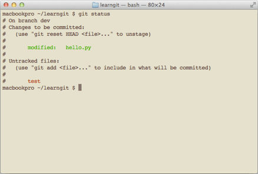

在 [安装 Git](../start/installation) 一节 中，我们已经配置了`user.name`和`user.email`，实际上，Git 还有很多可配置项。

比如，让 Git 显示颜色，会让命令输出看起来更醒目：

```
$ git config --global color.ui true
```

这样，Git 会适当地显示不同的颜色，比如`git status`命令：



文件名就会标上颜色。

我们在后面还会介绍如何更好地配置 Git，以便让你的工作更高效。
