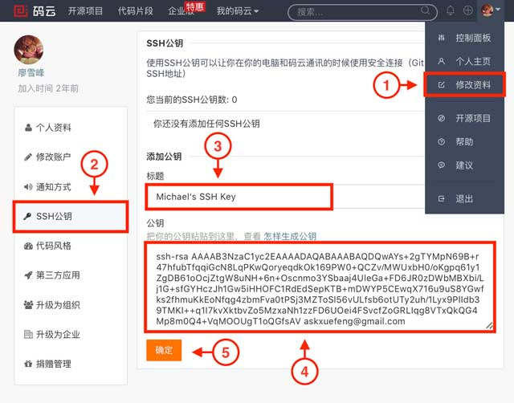
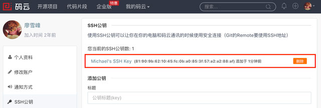

使用 GitHub 时，国内的用户经常遇到的问题是访问速度太慢，有时候还会出现无法连接的情况。

如果我们希望体验 Git 飞一般的速度，可以使用国内的 Git 托管服务——[Gitee](https://gitee.com/)。

和 GitHub 相比，Gitee 除了提供免费的 Git 仓库，还集成了代码质量检测、项目演示等功能。对于团队协作开发，Gitee 还提供了项目管理、代码托管、文档管理等服务，5 人以下小团队免费。


Gitee 的免费版本也提供私有库功能，只是有 5 人的成员上限。


使用 Gitee 和 GitHub 类似，我们在 Gitee 上注册账号并登录后，需要先上传自己的 SSH 公钥。选择右上角用户头像中的「修改资料」，然后选择「SSH 公钥」，填写一个便于标识的标题，然后把用户主目录下的 .ssh/id_rsa.pub 文件的内容粘贴进去：



点击「确定」即可完成并看到刚才添加的 Key：



如果我们已经有了一个本地 Git 仓库（例如，一个名为 learngit 的本地库），如何把它关联到 Gitee 的远程库上呢？

首先，我们在 Gitee 上创建一个新的项目，选择右上角用户头像中的「控制面板」菜单，然后点击「创建项目」：


项目名称最好与本地库保持一致。

然后，我们在本地库上使用命令`git remote add`把它和 Gitee 的远程库关联：

```
$ git remote add origin git@gitee.com:liaoxuefeng/learngit.git
```

之后，就可以正常使用`git push`和`git pull`推送了。

如果在使用命令`git remote add`时报错：

```
git remote add origin git@gitee.com:liaoxuefeng/learngit.git
fatal: remote origin already exists.
```

这说明本地库已经关联了一个名叫 origin 的远程库，此时，可以先用`git remote -v`查看远程库信息：

```
git remote -v
origin	git@github.com:michaelliao/learngit.git (fetch)
origin	git@github.com:michaelliao/learngit.git (push)
```

可以看到，本地库已经关联了 origin 的远程库，并且，该远程库指向 GitHub。

我们可以删除已有的 GitHub 远程库：

```
$ git remote rm origin
```

再关联 Gitee 的远程库（注意路径中需要填写正确的用户名）：

```
$ git remote add origin git@gitee.com:liaoxuefeng/learngit.git
```

此时，我们再查看远程库信息：

```
$ git remote -v
origin	git@gitee.com:liaoxuefeng/learngit.git (fetch)
origin	git@gitee.com:liaoxuefeng/learngit.git (push)
```

现在可以看到，origin 已经被关联到 Gitee 的远程库了。通过`git push`命令就可以把本地库推送到 Gitee 上。

有的小伙伴又要问了，一个本地库能不能即关联 GitHub，又关联 Gitee 呢？

答案是肯定的，因为 Git 本身是分布式版本控制系统，可以同步到另外一个远程库，当然也可以同步到另外两个远程库。

使用多个远程库时，我们要注意，Git 给远程库其的默认名称是 origin，如果有多个远程库，我们需要用不同的名称来标识不同的远程库。

仍然以 learngit 本地库为例，我们先删除已关联的名为 origin 的远程库：

```
$ git remote rm origin
```

然后，先关联 GitHub 的远程库：

```
$ git remote add github git@github.com:michaelliao/learngit.git
```

注意，远程库的名称叫 github，不叫 origin 了。

接着，再关联 Gitee 的远程库：

```
$ git remote add gitee git@gitee.com:liaoxuefeng/learngit.git
```

同样注意，远程库的名称叫 gitee，不叫 origin。

现在，我们用`git remote -v`查看远程信息，可以看到两个远程库：

```
$ git remote -v
gitee	git@gitee.com:liaoxuefeng/learngit.git (fetch)
gitee	git@gitee.com:liaoxuefeng/learngit.git (push)
github	git@github.com:michaelliao/learngit.git (fetch)
github	git@github.com:michaelliao/learngit.git (push)
```

如果要推送到 Github，使用命令：

```
$ git push github master
```

如果要推送到 Gitee，使用命令：

```
$ git push gitee master
```

这样一来，我们的本地库就可以同时与多个远程库相互同步：


A[Local Repo] --> B[GitHub]
A --> C[Gitee]


Gitee 也同样提供了 Pull request 功能，可以让其他小伙伴参与到开源项目中来。
